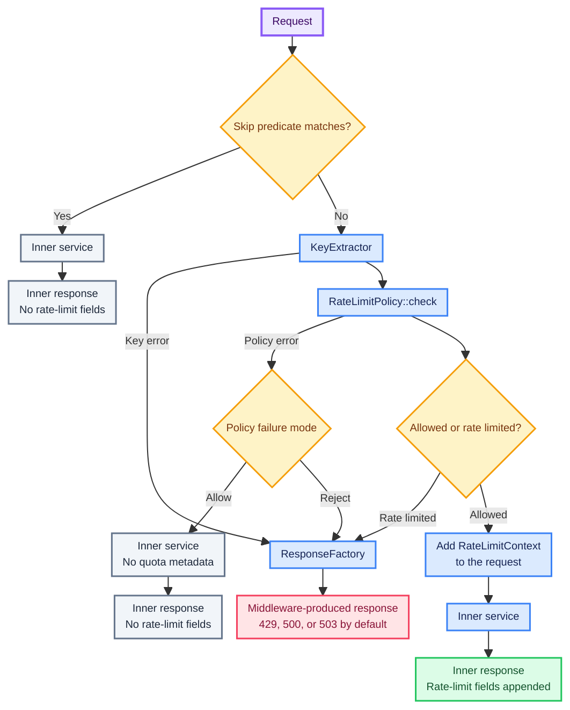

# How it works

`tower-rate-limiter` separates rate-limit policy from application concerns through three narrow
interfaces.

## The request lifecycle

For each request presented to the Layer, the service follows this order:

1. Evaluate the optional bypass predicate.
2. Extract the client key synchronously.
3. Derive the policy-scoped key and apply optional key encoding.
4. Ask the selected policy to charge that key.
5. Evaluate the returned Decision.
6. Call the already-ready inner service or build an immediate response.

Charging happens before the downstream call. The middleware does not refund quota when a handler
returns an error, because the request already consumed application work.

## Client key extraction

`KeyExtractor` synchronously derives an application-owned client key from the request. The crate
does not decide whether callers are identified by an account, credential owner, peer address, or
another value.

`IpKeyExtractor` reads only a peer `SocketAddr` extension and returns its `IpAddr`; it never trusts
an HTTP field. `ClientIpKeyExtractor` uses `http-extract` to check `Forwarded`, `X-Forwarded-For`,
`X-Real-IP`, and `CF-Connecting-IP`, in that order, then falls back to the peer address. These
headers are raw assertions rather than authenticated identities. The application deployment must
ensure a trusted proxy removes or overwrites every accepted header before selecting that adapter
for security-sensitive rate limiting.

`TrustedProxyClientIpKeyExtractor` makes the transport trust decision per request. It first requires
the socket peer, then calls an application-supplied synchronous `Fn(IpAddr) -> bool` policy. An
untrusted peer's forwarding Headers are ignored and the peer becomes the key. A trusted peer uses
the same strict Header selection as `ClientIpKeyExtractor` and falls back to the peer only when all
supported Headers are absent. A malformed first-present Header still fails closed. The crate does
not infer trust from environment variables or Header contents.

## Policy charging

`RateLimitPolicy` owns the algorithm and quota. It asynchronously charges a complete scoped key and
returns a `Decision`: `Allowed` or `RateLimited`, together with the advertised limit, window,
remaining capacity, reset duration, and—when rejected—the earliest retry duration.

Policy implementations must return a normal rate-limited Decision when quota is exhausted. They
reserve `RateLimitError::Policy` for cases where they cannot produce a trustworthy Decision. Policy
failures reject by default. Applications that explicitly prefer availability can select
`PolicyFailureMode::Allow`; the inner service is then called without claiming quota metadata.

## Fixed-window behavior

`FixedWindow<S>` is the included policy. It delegates atomic fixed-window usage to a
`FixedWindowStore`. The first increment starts a window. Later increments update usage but do not
move its end time. After expiry, the next charged request starts a new window.

The first `limit` charged requests are allowed. Request `limit + 1` is rejected, but still
increments usage without extending the window. This behavior is predictable and inexpensive, but
traffic may burst around a boundary: a caller can use the end of one window and the beginning of the
next in quick succession.

## GCRA behavior

The optional `MemoryGcra`, `RedisGcra`, and `PostgresGcra` policies use the generic cell rate
algorithm (GCRA): a quota replenishes continuously, while `burst` is the total capacity a fresh
key can spend immediately. Each currently has a fixed request cost of one. `GcraQuota` rounds the
emission interval up to whole microseconds so the built-in adapters do not exceed the requested
long-term rate.

The policies return the same `Decision` meanings but do not promise identical timing fields: Memory
uses a process clock, Redis server time, and PostgreSQL database time after row locking. Choose
Memory only for process-local enforcement; Redis and PostgreSQL share state across replicas. See
[GCRA backends](gcra.md) for the common contract and its backend-specific guides.

Sliding windows, token buckets, weighted requests, and refunds are not included in the current
release.

## Responses and context

`ResponseFactory` maps middleware outcomes to the application's response body, status, headers, and
logging policy. The default factory returns:

| Outcome | Status |
| --- | --- |
| Rate limited | `429 Too Many Requests` |
| Client key failure | `500 Internal Server Error` |
| Policy failure | `503 Service Unavailable` |

Allowed requests receive `RateLimitContext` in their extensions. Its policy entries contain the
policy name and `Decision`. Use `decision.remaining()` for remaining capacity. The context is absent
on bypass and fail-open paths; downstream code should treat absence as “no trustworthy limiter
metadata,” not as “unlimited.”

Nested Layers append policies instead of overwriting context or response fields. See
[Rate limit fields](rate-limit-fields.md) for the wire representation.

## Request bypass

`RateLimitBuilder::skip` accepts a synchronous predicate over the request head. A bypassed request
reaches the inner service without key extraction, policy charging, response fields, or
`RateLimitContext`.

Only use application-trusted headers or extensions in this predicate. Prefer a validated identity
extension over matching a raw credential.

## Layer scope and composition

Where the Layer is installed determines which routes enter the policy. Use separate Layers for
separate route scopes, and give semantically different policies distinct names.

Nested limiters charge independently. If an outer policy allows the request, an inner policy may
still reject it; the outer charge is not refunded. On allowed requests, context entries and response
fields are appended in composition order.

## Tower readiness

`RateLimit` implements `Service` when its wrapped Service implements `Clone`. During
`RateLimit::call`, the middleware replaces the wrapped Service with a clone and moves the exact
instance observed ready into `ResponseFuture`. Key extraction begins in the outer call, policy
charging runs while the response Future is polled, and `Inner::call` runs only
after the request is allowed. This preserves Tower's readiness contract while leaving the middleware
ready for a later request. Application code should still apply timeouts and load-shedding at the
appropriate service boundaries.
