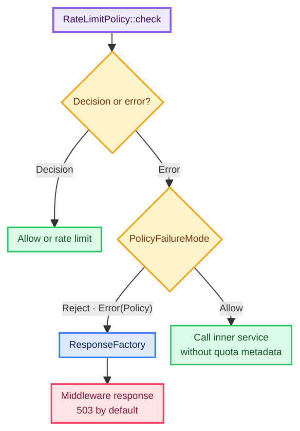

# Configuration

`RateLimitLayer::builder(...)` uses concrete generic types for the extractor, policy, and response
factory. Most configuration is shared immutable state, so cloning a finished Layer is cheap and
produces services with the same policy.

## Builder reference

| Method | Default | Purpose |
| --- | --- | --- |
| `with_policy(policy)` | none | Select the required `RateLimitPolicy` |
| `policy_name(name)` | `default-policy` | Set the stable policy and key-scoping identity |
| `response_factory(factory)` | empty default responses | Customize middleware-produced responses |
| `policy_failure_mode(mode)` | `Reject` | Reject or fail open after a policy failure |
| `policy_failure_tracing_level(level)` | `WARN` | Select the policy-failure event level with `tracing` enabled |
| `rate_limit_fields(fields)` | `Draft11` | Select or disable response fields |
| `with_key_encoder(fn)` | raw scoped key | Transform the complete key before policy charging |
| `skip(predicate)` | never bypass | Exempt trusted requests before charging |

Calling `with_policy(...)` or `response_factory(...)` replaces the previously selected component
of that kind.

## Policy identity and state sharing

Before calling the policy, the middleware scopes the extracted client key with the policy name.
Layers intentionally share state only when all of these match:

- the same policy instance or logically shared policy backend;
- the same policy name;
- the same extracted client key;
- equivalent key encoding.

Treat a policy name as a stable identifier, not display text. It must be non-empty visible ASCII;
the middleware escapes `"` and `\\` when representing it as a Draft 11 Structured Fields string.
When policies use a backend, its own key format and namespace remain an implementation detail.

## Policy failure mode

`PolicyFailureMode::Reject` is the default. It returns the response selected by `ResponseFactory`
without calling the inner service.

`PolicyFailureMode::Allow` favors availability. When a policy returns an error, the inner service
is called without `RateLimitContext` or rate-limit fields because no trustworthy Decision exists.
Client-key failures never fail open.

Enable the `tracing` Cargo feature to emit an event for every policy failure. Events default to
`WARN`; configure a policy with `.policy_failure_tracing_level(tracing::Level::ERROR)` when another
level is appropriate. The stable target is `tower_rate_limiter::policy`; fields contain
`policy_name`, `event=policy_failure`, `failure_mode`, and `error_code`. Events deliberately omit
the Client Key and diagnostic error message. The library emits events through the application's
subscriber and never installs one.

Enable the feature and add `tracing` as a direct application dependency when configuring a custom
event level:

```toml
[dependencies]
tower-rate-limiter = { version = "0.2", features = ["tracing"] }
tracing = "0.1"
```

The feature enables policy-failure events inside `tower-rate-limiter`; the direct `tracing`
dependency lets application code name values such as `tracing::Level::ERROR` in the builder call.



Choose this per policy based on the cost of under-enforcement:

| Policy type | Typical starting point |
| --- | --- |
| Abuse protection on a public read endpoint | `Allow` may be acceptable |
| Login, expensive work, paid quota, or write protection | Prefer `Reject` |

This table is operational guidance, not an automatic security policy.

## Key encoding

By default, the complete scoped key is passed to the policy unchanged. Use
`.with_key_encoder(...)` when raw identities must not reach a policy backend or when it needs a
constrained representation.

The callback runs synchronously in the middleware future. It must be deterministic,
collision-resistant for the application's key space, non-blocking, free of I/O, and non-panicking.
The crate does not choose a hashing algorithm or detect collisions.

Changing the encoder changes Policy Decision identity. Roll it out as a policy migration: old state
will not automatically merge into the new representation.

## Bypass

`.skip(...)` receives `&Request<()>`, which contains the request head and extensions but no body.
When it returns `true`, the request reaches the inner service without key extraction, policy
charging, rate-limit fields, or context.

The predicate is synchronous. Use only cheap, trusted request state such as an authentication result
or deployment-validated peer extension. Do not treat an arbitrary client-supplied header as an
allowlist signal.
